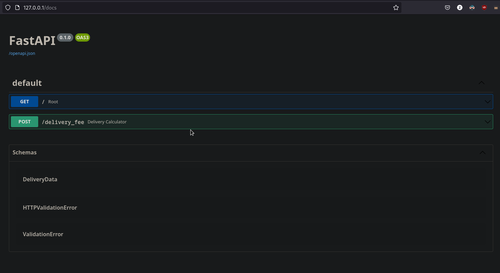

# Delivery Fee Calculator API


***
An API for calculating the delivery fee.

## Description

A single endpoint API that calculates the delivery fee based on the information in the request payload (JSON) 
and includes the calculated delivery fee in the response payload (JSON). The API is build using Python and FastAPI


### Dependencies
The API has been dockerized and will require docker desktop to run successfully.
* Install [Docker Desktop](https://www.docker.com/products/docker-desktop/)


### Running API
* Make sure the docker daemon is running.
* Make sure you are in the root directory of the project. The root directory contains the Dockerfile.
```
.
├── app
│   ├── delivery_fee_calculator.py
│   ├── helper
│   │   ├── helper_functions.py
│   │   └── __init__.py
│   ├── __init__.py
│   └── test
│       ├── __init__.py
│       └── test_delivery_fee_calculator.py
├── Dockerfile
├── README.md
└── requirements.txt

```

* Run the commands below in the project root directory to build the Docker image with tag.

```
docker build -t fastapi_delivery_calculator .
```

* Run the command below to start the container. It starts the container and maps host port 80 to containers port 80.

```
docker run -d --name fast_api_app -p 80:80 fastapi_delivery_calculator
```
* Once the container is running you can access the Open API Docs by clicking [here](http://127.0.0.1:80/docs).
* If another application is running on port 80, you can change the port in DockerFile on **line 13** ,
and adjust the above command accordingly.
    ```
    docker run -d --name <Container Name> -p <port host: port container> <Image Name>
  ```
    * The Open API Docs are then available on the url: **localhost:port/docs**
* In the Open API Docs select the **POST** method for the endpoint "**_/ delivery_fee_**".
* Click on **Try it out** and then ---> **Execute**. 
* This sends a JSON request to the API and the API response can be seen in the response body.
* You can change the values in the request body to test out the API.



### Testing API
* Test have been defined for the API using Pytest.
* Make sure the previously created container is running, and you are in the root directory. 
* Run the command below to run test.
```
docker exec -it fast_api_app sh -c "pytest" 
```

***


